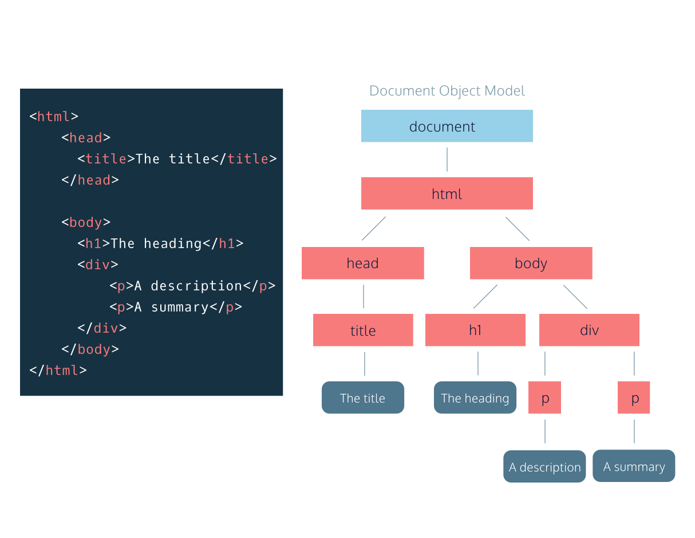

## El Modelo de Objetos del Documento (DOM)

### ¿Qué es el DOM?

El Modelo de Objetos del Documento, abreviado DOM por sus siglas en inglés, es una estructura poderosa similar a un árbol que permite a los programadores conceptualizar la jerarquía y acceder a los elementos en una página web.

El DOM es uno de los acrónimos mejor nombrados en el campo del desarrollo web. De hecho, una forma útil de entender lo que hace el DOM es descomponiendo el acrónimo, aunque no en el orden correcto:

El DOM es un Modelo lógico similar a un árbol que organiza el Documento HTML de una página web como un Objeto.
El DOM es implementado por los navegadores para permitir que JavaScript acceda, modifique y actualice la estructura de una página web HTML de manera organizada.

Por esta razón, nos gusta pensar en el DOM como el enlace entre una página web HTML y los lenguajes de programación.

### Recursos para seguir aprendiendo

- **MDN Web Docs sobre DOM:** [Document Object Model (DOM)](https://developer.mozilla.org/es/docs/Web/API/Document_Object_Model)
- **W3Schools DOM Tutorial:** [DOM Tutorial](https://www.w3schools.com/js/js_htmldom.asp)
- **Curso en línea gratuito de JavaScript en Codecademy:** [Curso de JavaScript](https://www.codecademy.com/learn/introduction-to-javascript)

## El DOM como una Estructura de Árbol

La modelización en forma de árbol se utiliza en muchos campos, incluyendo la ciencia evolutiva y el análisis de datos. Quizás ya estés familiarizado con el concepto de árboles genealógicos: estos gráficos representan las relaciones familiares entre los descendientes de un apellido dado.

El árbol DOM sigue una lógica similar a la de un árbol genealógico. Un árbol genealógico está compuesto por miembros de la familia y sus relaciones con el apellido familiar. En ciencias de la computación, llamaríamos a cada miembro de la familia un nodo.

Definimos un nodo como un punto de intersección en un árbol que contiene datos.

En el árbol DOM, el nodo más alto se llama nodo raíz y representa el documento HTML. Los descendientes del nodo raíz son las etiquetas HTML en el documento, comenzando con la etiqueta `<html>`, seguida de las etiquetas `<head>` y `<body>` y así sucesivamente.

## Revisión

Modelo de Objetos del Documento, o DOM, como una estructura!

Repasemos:

- El DOM es un modelo estructural de una página web que permite que los lenguajes de programación accedan a esa página.
- El sistema de organización en el DOM imita la estructura de anidación de un documento HTML.
- Los elementos anidados dentro de otro se denominan hijos de ese elemento. El elemento en el que están anidados se llama elemento padre de esos elementos.
- El DOM también permite acceder a los atributos de un elemento HTML, como style, id, etc.
